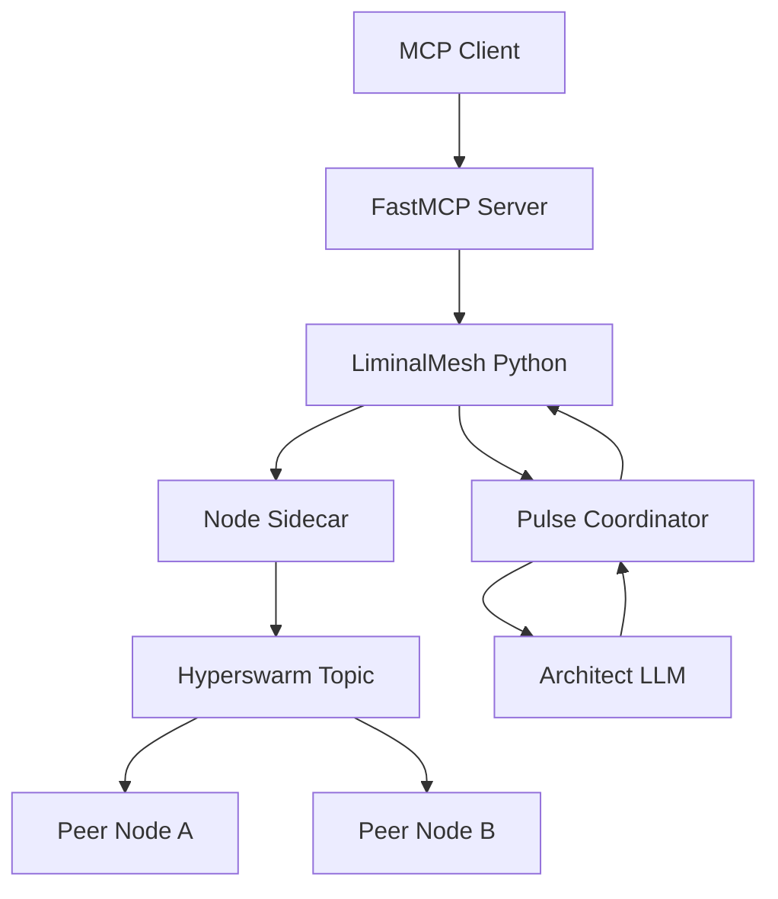
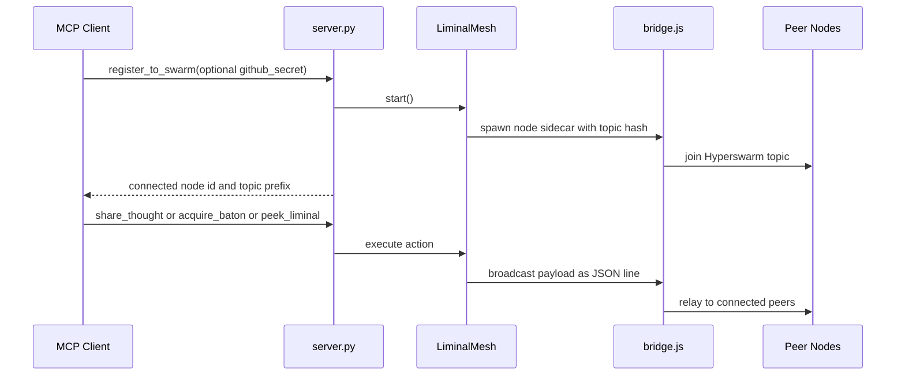
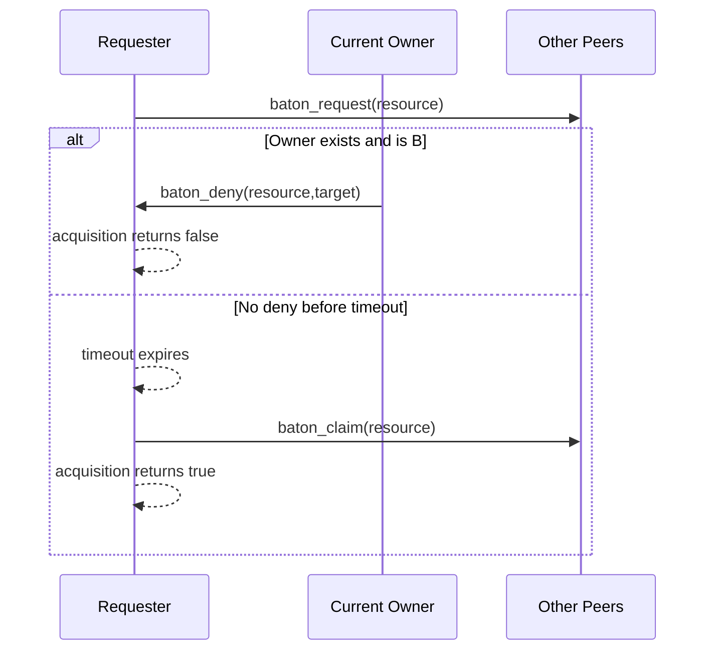
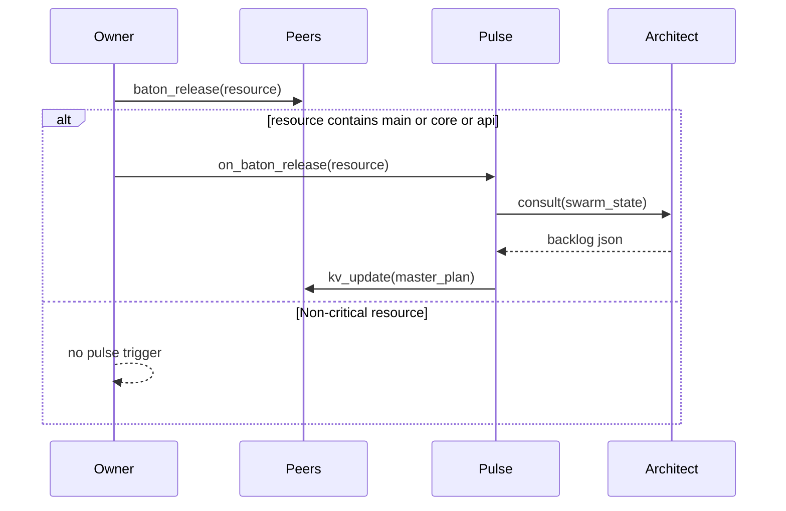
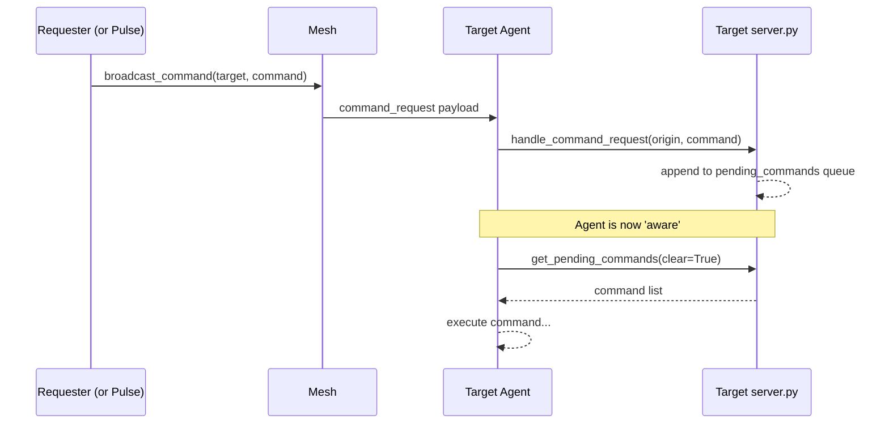
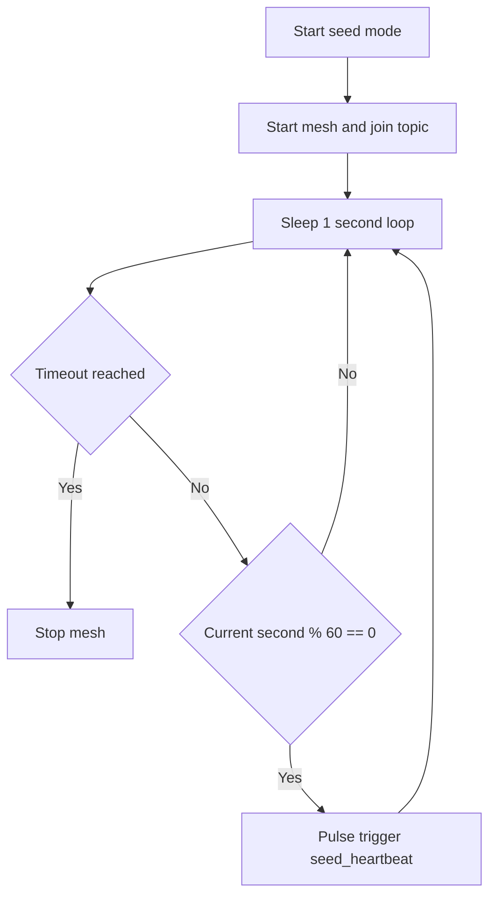

# Liminal Bridge

Liminal Bridge is the coordination substrate used by Keystone Polyphony for multi-agent collaboration.
It provides shared context, lightweight locking, and optional planning assistance over a peer-to-peer mesh.

## Purpose and Scope

Liminal Bridge implements four collaboration primitives:

- Shared context: agents publish short state updates as `thoughts`.
- Mutex-style locking: agents acquire and release `batons` on resources such as file paths.
- Shared key/value state: agents write swarm-level values into `kv_store`.
- Planning loop: `Pulse` can consult `Architect` and publish a `master_plan` into the shared store.

Current implementation is intentionally lightweight and best-effort. It favors speed and ease of bootstrapping over strict distributed consistency.

## Architecture



### Component Responsibilities

- `src/liminal_bridge/server.py`: exposes MCP tools and manages run modes (`mcp` and `seed`).
- `src/liminal_bridge/mesh.py`: in-memory shared state, message handling, lock behavior, and multi-modal transport switching (MQTT, BLE).
- `src/liminal_bridge/sidecar/bridge.js`: peer discovery and peer message transport through Hyperswarm (used as a fallback and default routing).
- `src/liminal_bridge/pulse.py`: controlled trigger path for planner consultation.
- `src/liminal_bridge/architect.py`: optional LLM-backed planner (`DUCKY_API_KEY`, `DUCKY_MODEL`).

## Shared State Model (Liminal Space)

`LiminalMesh` maintains three in-memory maps:

| Store | Shape | Meaning |
|---|---|---|
| `thoughts` | `origin_node_id -> content` | Most recent thought per agent |
| `batons` | `resource -> owner_node_id` | Current lock owner per resource |
| `kv_store` | `key -> value` | Shared application values (for example `master_plan`) |

Important: these stores are process-local and ephemeral. They are not persisted across restarts.

## Wire Protocol

Messages are JSON objects. For multi-modal routing, `LiminalMesh.broadcast()` determines the transport:
- **Macro (MQTT):** Routes via `broadcast_macro` if urgency is high or distance > 5.0m. Requires `MQTT_HOST` configured.
- **Micro (BLE):** Routes via `broadcast_micro` using GATT characteristics if distance < 1.0m. Requires `BLE_ENABLED=true`.
- **Fallback (Hyperswarm):** Sent to the Node.js sidecar via stdin as line-delimited JSON if other transports fail or aren't configured.

Every outbound broadcast from Python adds:

- `origin`: sender node id.
- `timestamp`: sender wall-clock timestamp.
- `urgency`: urgency flag used for transport attenuation.
- `vc`: current vector clock state.

Application payload message types:

| Type | Producer | Consumer behavior |
|---|---|---|
| `thought` | any node | writes `thoughts[origin] = content` |
| `kv_update` | any node | writes `kv_store[key] = value` |
| `baton_request` | lock requester | if local node owns the resource, sends `baton_deny` |
| `baton_deny` | current owner | requester resolves acquisition attempt as denied |
| `baton_claim` | requester after timeout | receivers set `batons[resource] = origin` |
| `baton_release` | current owner | receivers remove baton if owner matches origin |
| `command_request` | any node | triggers `on_command_request` callback on target node |
| `log` | any node | adds log entry to local `LogAggregator` |

## Operational Flows

### 1) Swarm Registration and Tool Use



### 2) Baton Acquire Flow



### 3) Baton Release and Optional Planning Trigger



### 4) Command Issuance and Execution



### 5) Seed Mode Background Pulse



## Running Liminal Bridge

### Prerequisites

- Python environment with project dependencies installed.
- Node.js installed.
- Sidecar dependencies installed:

```bash
npm install --prefix src/liminal_bridge/sidecar
```

### Start MCP Mode (default)

```bash
export SWARM_KEY="replace-with-shared-secret"
python src/liminal_bridge/server.py --mode mcp
```

### Start Seed Mode

```bash
export SWARM_KEY="replace-with-shared-secret"

# AI node (random identity - default)
python src/liminal_bridge/server.py --mode seed --timeout 600

# Human node (stable identity)
python src/liminal_bridge/server.py --mode seed --node-name "jules-laptop"

# Explicit stable seed
python src/liminal_bridge/server.py --mode seed --seed "my-stable-seed"
```

Seed mode keeps one node online to aid peer discovery and periodically attempts pulse checks. Use `--node-name` for stable identities across restarts.

### Run the Local Smoke Simulation

```bash
python simulate_swarm.py
```

This launches two local agents with scripted thought/lock actions so you can observe baton arbitration and shared-thought propagation.

## MCP Tool Contract

| Tool | Inputs | Behavior | Return shape |
|---|---|---|---|
| `register_to_swarm` | `github_secret` optional | starts mesh; if secret differs, recreates mesh with new topic | status string with node id and topic prefix |
| `share_thought` | `thought` string | auto-starts mesh if needed, writes local thought, broadcasts thought | fixed string `Thought streamed.` |
| `set_status` | `status` string | sets node status (e.g. `idle`, `busy`) and broadcasts it | status confirmation |
| `acquire_baton` | `file_path` string | auto-starts mesh if needed, runs deny-or-timeout lock attempt | `SUCCESS: ...` or `DENIED: ...` string |
| `release_baton` | `file_path` string | auto-starts mesh if needed, releases only if this node owns baton; then evaluates pulse trigger heuristic | status string |
| `peek_liminal` | `key` optional | returns one key from `kv_store` or full liminal snapshot | Python stringified dict/value (not strict JSON) |
| `consult_architect` | `context` string | auto-starts mesh if needed, calls `Pulse.trigger("manual:<context>")`, reads `master_plan` from KV | status string containing plan |
| `broadcast_command` | `command` string, `target` optional, `capabilities` optional | sends a command execution request to the swarm | confirmation string |
| `get_pending_commands` | `clear` optional | retrieves all commands sent to this node | JSON array of commands |
| `list_idle_agents` | - | returns list of nodes currently in `idle` status | JSON array of nodes |
| `ensemble_chat` | `topic` string, `message` string | auto-starts mesh if needed, posts a persistent message to a topic-based thread | confirmation string |
| `get_ensemble_chat` | `topic` string | auto-starts mesh if needed, retrieves the persistent history of a discussion topic | JSON array of messages |
| `list_peers` | - | returns list of connected peer IDs | JSON with `peers` array and `count` |
| `get_health_status` | - | returns mesh operational health | JSON with `status`, `reason`, `mode` |
| `get_my_node_id` | - | returns this node's unique identifier | node ID string |
| `broadcast_message` | `message` string, `urgency` optional | broadcasts raw message to all peers | confirmation string |
| `restart_sidecar` | - | restarts the Node.js sidecar if crashed | confirmation string |

`Pulse` has a 5-minute cooldown. Repeated `consult_architect` calls inside the cooldown window may return an unchanged plan. Current MCP tools do not pass the special `force` context.

## Guarantees and Non-Guarantees

What the current system guarantees:

- Nodes sharing the same `SWARM_KEY` topic can exchange JSON messages.
- Unique identities per node (random for AI, stable with `--node-name` for humans).
- Graceful sidecar crash handling with auto-restart (up to 100 retries).
- Local callers get immediate lock decisions when resource state is already known.
- `master_plan` updates are broadcast through the same mesh path as other updates.

What it does not guarantee yet:

- Durable state across process restart (partially implemented via SQLite).
- Strongly consistent lock ownership under partitions or simultaneous timeout claims.
- Deterministic conflict resolution beyond last-write-wins style overwrites.

## Known Limitations and Roadmap Alignment

The implementation intentionally leaves several distributed-system concerns open. Planned follow-ups are tracked in `TODO.md`, including:

- persistence and snapshotting,
- CRDT and vector-clock improvements,
- per-agent identity and key rotation,
- stronger observability and load testing.

## Troubleshooting

- No peers discovered: verify all nodes use the same `SWARM_KEY` and can run Node sidecar.
- `Architect not configured`: set `DUCKY_API_KEY` and ensure `openai` package is installed.
- Baton behavior appears inconsistent: this can happen during concurrent timeout-based claims; treat current locking as cooperative best-effort.
- Sidecar crashes: Node will auto-restart the sidecar up to 100 times. Use `get_health_status` to check if sidecar is dead.
